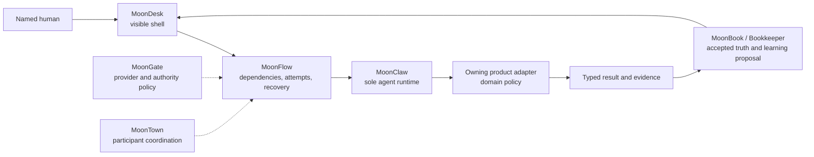
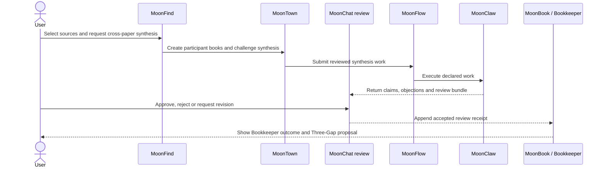
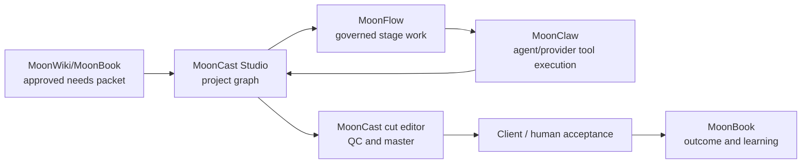

# MoonSuite interproduct UI-to-UI journeys

This document is both a qualification report and an operator tutorial for the
cross-product loops that are meant to make MoonSuite feel like one system.
Standalone product journeys are recorded in the sibling reports; this file
tests the seams between products.

The central distinction is:

- a graph node proves that MoonDesk can *describe* work;
- a visible handoff, receiving-product state, durable receipt, and visible
  return path prove that products can *perform* work together.

## Qualification boundary

A result in this document is `PASS` only when the operator:

1. starts from a visible product control;
2. crosses the real product host boundary;
3. sees the receiving product, run, evidence, denial, or review state;
4. can relate that state to a durable artifact;
5. does not rely on browser-side model injection or a direct API call;
6. retains the product's authority ceiling.

An external fixture is allowed, but the operator must visibly select, paste, or
import it. Preparing a source folder does not count as the UI action.

No journey in this report authorizes credentials, licensed-provider use,
publication, trading, payment, or a physical robot command.

## Current qualification snapshot

The evidence run described below used isolated state on 2026-07-31.

| ID | Journey | Result | Proven boundary | First unproven or blocked boundary |
| --- | --- | --- | --- | --- |
| IP-01 | 63-stage composition and governed-run start | `BLOCKED` | Visible import, 63-node/11-product rendering, Fit, zoom, drag, pan, composition save, run creation, and restart recovery all crossed the real hosts | MoonFlow published one runnable item but no authority-bound operator action; moved-node layout also reset after restart |
| IP-02 | MoonFind → MoonTown → MoonChat → MoonBook/Bookkeeper | `BLOCKED` | MoonFind visibly describes the desired research and Three-Gap closure | MoonFind has no visible MoonTown handoff/open action; MoonChat has no standalone app entrypoint |
| IP-03 | MoonWiki/MoonBook → MoonCast → MoonFlow | `BLOCKED` | The immutable packet was visibly imported and approved, and its exact brief/bible/script bindings produced a durable 1-episode/3-scene/15-shot project | G0–G5 production, accepted-master evidence, and the resulting MoonFlow handoff remain unexecuted |
| IP-04 | MoonProj + MoonMold + MoonRobo + MoonMoon + MoonVis | `BLOCKED` | The exact dependency and authority chain is present in the imported graph | A Flow node cannot visibly open its owning product or show a receiving-product receipt |

`BLOCKED` is not a pass. The smaller completed portions above are recorded so
that later work resumes at the first missing boundary instead of repeating
already-proven setup.

## Remediation addendum

The snapshot table above remains the original end-to-end classification. A
same-day rerun moved each journey's first missing boundary:

| ID | Newly proven visible boundary | Current end-to-end status |
| --- | --- | --- |
| IP-01 | Canonical `book.toml` / `wiki.toml` import no longer needs fixture `book.json`; the keyboard-moved node survived host restart; restored Flow state showed run sequence 64 and one generic **Open moonbook** action. | `BLOCKED` at the receiving MoonBook app/receipt and full 63-stage execution, not at layout persistence or action projection. |
| IP-02 | MoonFind recovered its durable terminal projection and opened a versioned, run-bound MoonTown handoff. MoonTown displayed exactly three invited books and labelled the salon **PENDING · NOT EXECUTED**. | `BLOCKED` at participant execution, reducer synthesis, MoonChat/named review, returned receipt, and MoonBook/Bookkeeper Three-Gap closure. |
| IP-03 | The operator imported and deliberately approved the immutable needs packet, approved the exact brief, created the bound project, and recorded G0. | `BLOCKED` at G1–G5, real provider media, populated Cut Editor/master, client acceptance, and the return to MoonFlow. |
| IP-04 | The 63-stage run now exposes a generic manifest-owned action; MoonProj formal safe-denial, MoonMold exact digital review, and MoonRobo dry-run denial also work in their own visible surfaces. | `BLOCKED` until a product action opens its configured receiver, the receiver records a correlated receipt, and Flow visibly recovers that receipt through the complete chain. |

The precise baseline→fix→rerun matrix and retained evidence are in
[2026-07-31 remediation](REMEDIATION_2026-07-31.md). A projected action is not
an executed stage, and a pending MoonTown intake is not a synthesis.

## Current focused qualification

The latest product-owned runbooks and the current focused replay are
consolidated in
[CONSOLIDATED_UI_TO_UI_2026-07-31.md](CONSOLIDATED_UI_TO_UI_2026-07-31.md).
That report is the current operator index; the baseline and remediation tables
above remain historical records.

The current pass treats the seams independently:

- a MoonFind receiver receipt closes only the exact MoonFind review work item;
  it is neither MoonChat execution nor MoonBook acceptance;
- MoonChat has no standalone UI and is qualified through MoonFind and
  MoonBook;
- MoonVis-to-MoonCast requires exact PNG bytes, digest, rights reference,
  timeline lineage, frozen render plan, and exact-build client review;
- MoonFish's installed 40–65-session v2 policy must not be mixed with the
  stale 2–20-session approved-artifact contract;
- the physical chain remains blocked at MoonProj plan-artifact review and the
  MoonMold-to-MoonRobo portable-envelope/UI boundary.

The focused browser run is now fully classified in the consolidated report.
Its research negative path stopped honestly: a named **Request changes**
decision normalized to `defer`, MoonChat retained `pending_review` /
`research-evidence`, and a work item requiring `accepted-knowledge` failed.
MoonFind rejected the failed ingest and created no MoonBook submission. The
plain MoonFind URL also had no genuine MoonFlow receiver token, so receiver
return remains `NOT-RUN` rather than fabricated.

## One execution spine



MoonFlow is orchestration functionality, not a second agent runtime. MoonClaw
executes agent/model/tool work. Domain products own domain rules. MoonBook's
Bookkeeper owns accepted learning and applies the Three-Gap review loop.

Every visible transition should expose:

- source and destination product;
- operation and schema versions;
- authority and claim ceiling;
- run and attempt identity;
- evidence or artifact reference;
- required reviewer;
- final receipt or explicit denial.

If a node does not tell the operator how to reach the receiving product, the
system is still operator-incomplete even when the backend operation exists.

## Isolated test environment

The 2026-07-31 run used:

| Surface | URL | Isolated state |
| --- | --- | --- |
| MoonDesk / MoonFlow | `http://127.0.0.1:44063/` | `/tmp/moonsuite-interproduct-ui.fBRY8C/suite` |
| MoonCast Studio | `http://127.0.0.1:44084/apps/mooncast/studio` | `/tmp/moonsuite-interproduct-ui.fBRY8C/mooncast-data` |
| MoonFind preview | `http://127.0.0.1:44187/` | read-only published UI snapshot; do not start its non-isolated saved session |

The temporary robotics source is:

```text
/tmp/moonsuite-interproduct-ui.fBRY8C/fixtures/robotics-book
```

The passive MoonWiki-to-MoonCast packet is:

```text
/tmp/moonsuite-interproduct-ui.fBRY8C/fixtures/moonwiki-needs.json
```

These paths are transient evidence, not product configuration.

## IP-01 — genuine 63-stage MoonFind graph in MoonDesk

### What this use case proves

This journey proves that a user can visibly import an exact MoonFind-authored
work model, inspect all 63 stages on MoonDesk's infinite canvas, manipulate the
canvas, and ask MoonFlow to validate/import the selected composition.

It does not prove that all 63 stages executed.

### Prepare the fixture

Use a new terminal:

```sh
RUN_ROOT="$(mktemp -d /tmp/moonsuite-interproduct-ui.XXXXXX)"
SUITE_ROOT="$RUN_ROOT/suite"
BOOK_ROOT="$RUN_ROOT/fixtures/robotics-book"
mkdir -p "$SUITE_ROOT" "$BOOK_ROOT"
```

Initialize the external MoonBook:

```sh
cd /Users/kq/Workspace/moonbook
moon run --release cmd/main -- wiki init "$BOOK_ROOT"
```

MoonDesk's folder importer requires `book.json` at the selected folder root.
MoonBook's current CLI initializer writes `book.toml` and `wiki.toml`, so add
this fixture-only compatibility manifest:

```json
{
  "id": "robotics-book",
  "name": "Humanoid Robotics Suite UI Qualification"
}
```

Write it as `$BOOK_ROOT/book.json`. This is an external input repair, not a
MoonDesk source modification.

Publish the exact graph and typed requests:

```sh
cd /Users/kq/Workspace/moonfind
moon run --release cmd/main -- publish-robotics-graph \
  "$BOOK_ROOT" \
  fixtures/humanoid-robotics-requests \
  fixtures/humanoid-robotics-capability-catalog.fixture.v1.json \
  2026-07-31T12:00:00Z
```

The supplied catalog is synthetic fixture evidence. Its health window must
contain the evaluation time. It must never be presented as a production
MoonGate provider catalog.

Before opening the UI, inspect only the source input:

```sh
jq '.items | length' "$BOOK_ROOT/flow/work-graph.json"
jq '[.items[].product_id] | unique' "$BOOK_ROOT/flow/work-graph.json"
jq '.operations | length' "$BOOK_ROOT/flow/capability-catalog.json"
```

Expected values are 63 items, 11 executing products, and 43 canonical
operations.

### Launch the real shell and orchestration bridge

Build MoonDesk's UI if needed:

```sh
cd /Users/kq/Workspace/moondesk
npm --prefix ui/rabbita-desk run build
```

Start MoonDesk on an unused port:

```sh
MOONFLOW_ROOT=/Users/kq/Workspace/moonflow \
MOONCLAW_ROOT=/Users/kq/Workspace/moonclaw \
moon run --release cmd/main -- serve "$SUITE_ROOT" \
  --ui ui/rabbita-desk/dist \
  --host 127.0.0.1 \
  --port 44063
```

Keep the terminal open. MoonGate being unavailable is acceptable for this
fixture-only composition pass; it must be visible as unavailable rather than
silently treated as production evidence.

### Perform the visible journey

1. Open `http://127.0.0.1:44063/`.
2. Stay in **Desk**.
3. Find **Import existing**.
4. Expand **Import from path**.
5. Enter the exact external `$BOOK_ROOT` in the **Folder path** field.
6. Click **Import Path**.
7. Confirm the library now contains **Humanoid Robotics Suite UI
   Qualification**. Select it if it was not auto-selected.
8. Click **Flow** in the primary navigation.
9. Wait for **Composition canvas**.
10. Confirm the summary says `Products · 63 / 63 nodes`.
11. Confirm there are 63 `article.flow-node` cards and 11 distinct
    `data-product-id` values.
12. Expand the catalog evidence and confirm the graph is conformant and the
    catalog is explicitly fixture-only.
13. Click **Fit**. All nodes should fit into the overview.
14. Click **Zoom in composition canvas**, then **Zoom out composition canvas**.
    The zoom percentage must change in both directions.
15. Drag empty canvas space and confirm the surface pans.
16. Drag the handle labelled **Move node understand-needs** and confirm only
    that node changes position.
17. Click **Start governed run**.
18. Confirm MoonFlow reports a durable run/import state and identifies
    `understand-needs` as the initial runnable item.
19. Open browser developer tools. Record console errors and failed network
    requests; neither list may contain an unexplained application error.
20. Reload the page, return to the imported book and **Flow**, and confirm the
    run and composition still appear.

Useful DOM anchors for automation or manual inspection are:

```text
[data-testid="desk-import-from-path"]
[data-testid="desk-import-book-path"]
[data-testid="desk-import-book"]
[data-testid="mode-flow"]
[data-testid="moonflow-composition-canvas"]
[data-testid="moonflow-prepare-selected"]
article.flow-node[data-work-item-id][data-product-id]
```

### Durable assertions

After the visible action, terminal inspection may corroborate it; terminal
inspection may not replace it:

```sh
jq '.items | length' \
  "$SUITE_ROOT/books/robotics-book/flow/work-graph.json"

find "$SUITE_ROOT/.moonsuite/products/moonflow" \
  -type f -maxdepth 6 -print
```

Retain the imported graph, selected-composition record, MoonFlow run
projection, capability snapshot, import receipt, browser console, failed
requests, and screenshots of import, fitted canvas, moved node, and run state.

### Failure learned during this run

The first visible import correctly failed with `Could not import MoonBook`.
The detailed host contract showed that the source lacked root `book.json`.
The library remained empty. Adding only the temporary compatibility manifest
made a fresh visible retry legitimate; the retry copied the book and its
`flow/work-graph.json` into the isolated suite.

This is useful product feedback: MoonBook's own initializer and MoonDesk's
importer currently disagree about the minimum portable manifest.

### Executed result

The 2026-07-31 browser run exercised the real UI and host boundaries:

- the canvas rendered 63 `article.flow-node` cards for 11 product IDs;
- **Fit** produced a 6% overview
  (`translate(44px, 44px) scale(0.06)`), and zoom reached 8%;
- a visible node drag moved `understand-needs` from `64px,72px` to
  `184px,142px`;
- a visible background drag panned the surface to
  `translate(115px, 70px) scale(1)`;
- **Save composition** returned
  **Composition saved · next run uses this selection**;
- **Start governed run** created run sequence 64 with 63 total items, one
  ready item, and `understand-needs-v3` as the first runnable declaration;
- after stopping and restarting MoonDesk, the imported book, 63 nodes, run
  sequence 64, and the first runnable projection all returned;
- both the initial run and restart had zero browser console warnings/errors.

Two required boundaries failed:

1. the run workspace displayed **NOT PUBLISHED** / **UNAVAILABLE** because
   MoonFlow had not published authority-bound operator handoffs; and
2. the moved node returned to `64px,72px` after restart, so the save action
   preserved the composition selection but not the operator's canvas layout.

The retained evidence is:

```text
/Users/kq/Workspace/moondesk/_build/ui-to-ui/2026-07-31-63-stage
```

Therefore IP-01 is `BLOCKED` end to end. Canvas interaction, run creation, and
restart recovery are proven subresults; 63-stage product execution is not.

## IP-02 — research reinforcement loop

### Intended interaction



The three Bookkeeper gaps are:

1. **knowledge gap** — what accepted knowledge was missing or wrong;
2. **capability gap** — what tool, workflow, or skill failed to produce the
   accepted outcome;
3. **outcome gap** — what real result differed from the intended result.

Bookkeeper may propose a new memory, policy, skill, or workflow version. It
must not self-approve that proposal.

### Visible test design

1. Open the published MoonFind UI.
2. Select or import the paper corpus visibly.
3. Start **governed cross-paper synthesis**.
4. Confirm a typed MoonTown handoff with source IDs, run ID, authority, and
   expected output.
5. Open the receiving MoonTown run from that visible handoff.
6. Confirm the participant books, independent roles, and reviewable synthesis.
7. Open the MoonChat review projection.
8. Record a named-human decision.
9. Open MoonBook/Bookkeeper from the result.
10. Confirm the accepted artifact, outcome binding, all three gaps, and any
    proposed learning.
11. Approve, reject, or defer the learning through a visible human control.
12. Reload and confirm the review and Bookkeeper receipt remain.

### Current blocker

The published MoonFind preview visibly shows:

- research execution, review, and Q&A controls;
- a static 63-stage robotics composition description;
- an **Open MoonClaw operator** link;
- text claiming a MoonTown four-role challenge and Bookkeeper route.

It does not expose a visible action or receipt that hands the selected research
to MoonTown. MoonChat intentionally has no standalone app entrypoint, and the
current MoonFind page does not open a MoonDesk/MoonBook review projection in
its place.

Therefore the first blocked boundary is **MoonFind → MoonTown**, not
Bookkeeper. The graph contains the later operations, but a rendered graph is
not the required receiving-product UI evidence.

The minimum feature needed to unblock this journey is a visible typed handoff
card with **Open in MoonTown**, followed by an **Open review** consumer surface
and **Open Bookkeeper outcome** return path.

## IP-03 — governed media loop

### Intended interaction

MoonWiki/MoonBook owns the durable need, rights, and creative intent. MoonCast
owns production. MoonFlow owns stage dependencies, retries, and recovery.
MoonClaw remains the only agent runtime. MoonGate resolves provider and
authority policy.



### Launch MoonCast with isolated state

```sh
cd /Users/kq/Workspace/mooncast
npm --prefix ui/rabbita-mooncast run build

MOONCAST_RABBITA_DIST=ui/rabbita-mooncast/dist \
MOONCAST_DATA_ROOT="$RUN_ROOT/mooncast-data" \
MOONCAST_PORT=44084 \
moon run --release cmd/studio
```

Open:

```text
http://127.0.0.1:44084/apps/mooncast/studio
```

### Prepare a safe MoonWiki packet

Use contract `moonwiki.mooncast-needs-export.v1`. It must include:

- three exact evidence references and three exact intent references for brief,
  bible, and script;
- customer, payable problem, audience, channels, acceptance, and repeat
  hypothesis;
- budget, 180–480 second duration, at most two revisions, deliverables, and
  payment milestones;
- confirmed rights, confidentiality, provider/data restrictions;
- creative objective, proposition, tone, metrics, and negative constraints;
- no unresolved question;
- `publication_authority: false`;
- `provider_execution_authority: false`.

Validate the packet against:

```text
/Users/kq/Workspace/mooncast/schemas/moonwiki-needs-export.schema.json
```

The qualification fixture uses a 180-second, review-only episode and explicitly
forbids invented claims, physical commands, and publication.

### Perform the visible intake and project journey

1. Open MoonCast Studio.
2. Select **Needs / Strategy**.
3. Paste the complete packet into **MoonWiki export packet**.
4. Click **Import immutable packet**.
5. Confirm the packet card is **complete**, **pending**, and **immutable**.
6. Confirm the displayed source IDs, versions, SHA-256 digests, and
   deterministic provenance digest match the packet.
7. Enter a named **Actor**, **Role**, and ISO-8601 **Decision time**.
8. Click **Confirm deliberate action**.
9. Click **Approve exact needs / strategy**.
10. Confirm the exact packet version changes to **approved**.
11. Enter a unique project ID such as `ui-journey-project-001`.
12. Click **Create intake-bound project**.
13. Open the project and confirm a visible
    `project → episode → scene → shot → asset` graph.
14. Confirm seeded brief, bible, and script refer to the exact MoonWiki intent
    records; no synthetic `moonwiki:*` source was invented.
15. Reload and confirm packet approval and project/intake binding remain.

This action must create no provider run and no publication.

### Continue to MoonFlow

For a full pass, continue through MoonCast's normal gates:

1. G0 qualified scenario;
2. G1 rights;
3. G2 bible/script;
4. G3 storyboard/animatic and budget;
5. asset factory and routed generation;
6. G4 per-shot QC;
7. cut-editor import, narrative/compliance edits, preview, export, and master
   promotion;
8. technical, creative, and rights review;
9. G5 accepted master;
10. **Prepare governed handoff**;
11. open the resulting MoonFlow run in MoonDesk;
12. confirm operation, authority, cost, evidence, and review state.

Do not grant G6 publication in local qualification.

### Current boundary

A fresh intake-bound project cannot legitimately jump to the MoonFlow handoff;
the handoff is available only after production and accepted-master evidence.
That fail-closed behavior is correct.

The intake/project portion must be recorded separately from the full
MoonCast-to-MoonFlow journey. Until the complete visible production lifecycle
is exercised, the latter remains unproven rather than being shortened with
direct service calls.

### Executed intake result

The 2026-07-31 browser run completed the intake/project portion through visible
controls:

- `ui-journey-needs-001` version 1 changed from **COMPLETE / PENDING /
  IMMUTABLE** to **APPROVED** after a named deliberate action;
- `ui-journey-project-001` revision 8 survived reload;
- the visible graph contained one episode, three scenes, and 15 shots;
- the brief, bible, and script JSON each retained its exact
  `ui-wiki-*-1` source identity, digest, and provenance reference;
- no synthetic `moonwiki:*` reference appeared;
- no provider, publication, payment, or client-acceptance authority was used;
- the browser reported zero warnings/errors.

Evidence is retained at:

```text
/Users/kq/Workspace/mooncast/_build/ui-to-ui/2026-07-31-interproduct-intake
```

The intake/project subjourney is a `PASS`. IP-03 remains `BLOCKED` overall
because no complete G0–G5 production, accepted master, or MoonFlow handoff was
created.

## IP-04 — safe robotics product chain

### Exact dependency chain

The 63-stage graph contains this digital-only spine:

| Stage | Product | Operation | Depends on | Authority |
| --- | --- | --- | --- | --- |
| `plan-project` | MoonProj | `moonproj/project.plan.prepare@0.1.0` | `stakeholder-review` | workspace mutation |
| `design-physical-assets` | MoonMold | `moonmold/spatial.operation.execute@0.2.0` | `plan-project` | workspace mutation |
| `integrate-robot` | MoonRobo | `moonrobo/robot.integrate-digital-model@0.2.0` | software + spatial design | workspace mutation |
| `simulate-missions` | MoonMoon | `moonmoon/simulation.robot-mission@0.1.0` | digital integration | sandbox execution |
| `readiness-inspect` | MoonRobo | `moonrobo/robot.readiness.inspect@0.2.0` | simulation | observe |
| `visualize-deliverable` | MoonVis | `moonvis/visual.asset-bundle.resolve@0.1.0` | readiness observation | workspace mutation |

The request bundle explicitly excludes physical robot commands and
publication.

MoonMold is first-class because its spatial model is a governed, versioned
domain artifact. It may be installed as a pack and used as a tool by a
MoonBook/MoonClaw job; those are deployment and invocation roles, not two
different runtimes.

### Visible test design

Start from the imported composition in IP-01:

1. Select `plan-project`; inspect its operation, input/output contracts,
   dependency, authority, and acceptance criteria.
2. Use a visible **Open in MoonProj** action. Confirm the receiving project
   plan and its source run ID.
3. Return to Flow and open `design-physical-assets` in MoonMold. Confirm
   dimensions, materials, lineage, and a digital-artifact receipt.
4. Open `integrate-robot` in MoonRobo. Confirm the UI says **digital model**
   and exposes no vendor-command control.
5. Open `simulate-missions` in MoonMoon. Run nominal, boundary, recovery, and
   failure simulation under `sandbox-execution`.
6. Return to MoonRobo's `readiness-inspect`. Confirm it reports observations
   and blockers, not physical readiness.
7. Open `visualize-deliverable` in MoonVis. Confirm design, simulation,
   provenance, uncertainty, readiness gaps, and open risks are inspectable.
8. Return to MoonDesk Flow. Confirm each node has a durable receiving-product
   receipt and the next dependency becomes runnable only after its predecessor.
9. Restart the shell/Flow host and confirm the active attempt and receipts
   recover.
10. Inspect authority evidence. Any request for physical command,
    publication, payment, or an undeclared provider must be visibly denied.

### Current blocker

The imported canvas presents node metadata and dependency edges, but the node
cards are not product-launch controls. The operator cannot open MoonProj,
MoonMold, MoonRobo, MoonMoon, or MoonVis from the selected Flow stage and then
return with a correlated receipt.

Consequently, IP-01 can qualify composition interaction while IP-04 remains
blocked at **MoonFlow node → owning product UI**.

The minimum cross-product feature is a generic, manifest-driven node action:

```text
Open owning product
  → same run/attempt/operation identity
  → receiving app entrypoint
  → typed result or denial
  → Return to Flow
```

MoonDesk and MoonFlow must not add robotics-specific branches to implement it.
The generic pack manifest, app entrypoint, authority, evidence, and review
contracts are sufficient.

## Evidence-capture checklist

For each run, create an untracked evidence folder:

```text
<product>/_build/ui-to-ui/<run-id>/
  run.json
  host.log
  browser-console.json
  failed-requests.json
  screenshots/
  receipts/
```

Record:

- product commits and dirty-worktree status;
- exact launch commands, ports, and isolated roots;
- fixture digests;
- browser URL and viewport;
- every visible click/type/drag;
- visible text and DOM anchors;
- durable artifact paths and digests;
- denied effects;
- first blocker, if any;
- restart/reload result.

Before assigning `PASS`, answer yes to all of these:

- Did a person use the visible initiating control?
- Did the real host boundary receive the action?
- Is the destination product or consumer projection visible?
- Is the result durable and correlated to the same run?
- Are authority and review requirements visible?
- Is the browser free of unexplained console and request failures?
- Did reload or restart preserve every state claimed as durable?

If any answer is no, use `FAIL`, `BLOCKED`, or `NOT-RUN`; do not infer a pass
from source code, a build, a direct API request, or a screenshot alone.

## Product gaps exposed by these journeys

1. **Portable MoonBook manifest mismatch.** MoonBook CLI initialization and
   MoonDesk folder import do not currently agree on `book.json`.
2. **No generic Flow-to-pack navigation.** The canvas shows ownership but does
   not let an operator enter the owning product with correlated identity.
3. **Canvas layout is not durable.** The selected composition and run survive
   restart, but a visibly moved node returns to its original coordinates.
4. **Research chain is asserted, not navigable.** MoonFind lacks a visible
   MoonTown handoff and review/Bookkeeper return path.
5. **Consumer projection for MoonChat is incomplete.** A separate MoonChat app
   is unnecessary, but the review contract must have a visible MoonDesk or
   MoonBook consumer surface in the chain.
6. **Media intake works, but production closure is absent.** MoonCast preserved
   exact MoonWiki source bindings and correctly prevents a fresh intake from
   producing a final MoonFlow handoff; qualification still needs a complete
   safe 3–8 minute fixture or provider run.
7. **Receiving-product receipts are not unified.** The operator needs a
   generic receipt drawer showing input/output contracts, authority, evidence,
   review, cost, owner, and return-to-Flow action.

The next integration milestone should implement the generic navigation and
receipt loop once, then let each product supply only manifest metadata and its
pack-owned UI.
