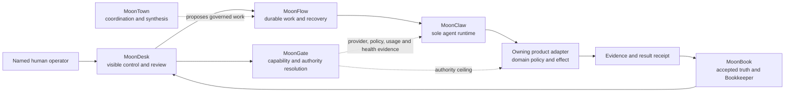
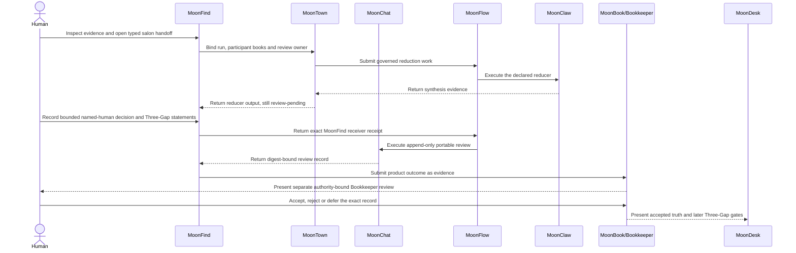
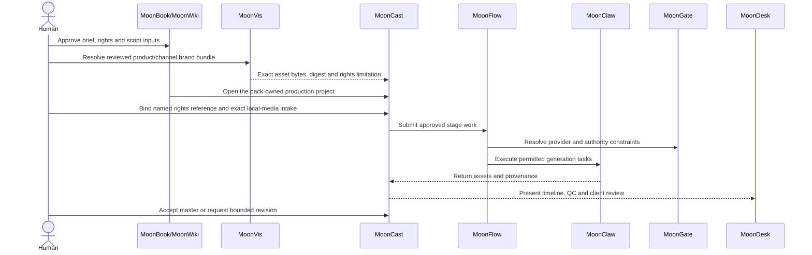
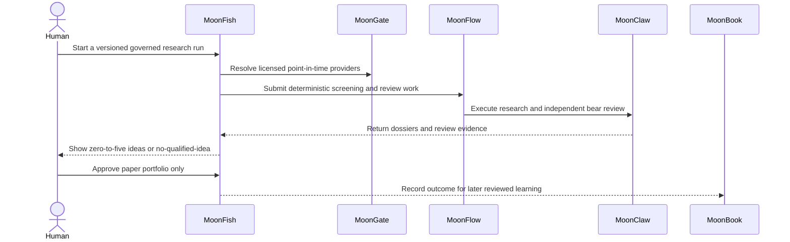
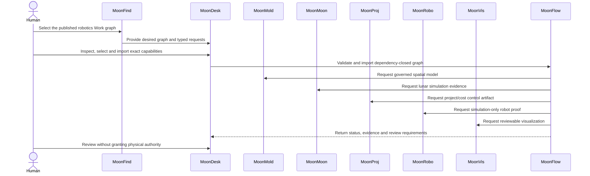
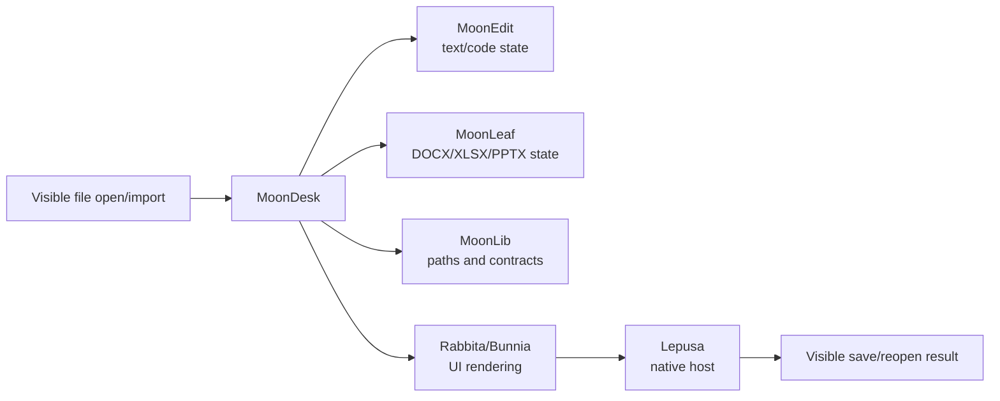

# MoonSuite product interaction map

MoonSuite has one execution spine and multiple domain products. A product may
provide a UI and domain operation, but it does not gain ownership of agent
execution, workflow recovery, provider policy, or accepted knowledge.

## Execution spine

The UI-to-UI boundary is not complete merely because MoonDesk renders a node.
The journey must show the initiating control, the exact operation and
authority, the receiving runtime or adapter state, and the resulting evidence
or denial.

## Ownership rules

| Concern | Owner | Visible projection |
| --- | --- | --- |
| Human navigation, selection and review | MoonDesk | Desk, Wiki, Code, Flow, Runs and hosted pack applications |
| Durable book truth and Bookkeeper Three-Gap learning | MoonBook | MoonBook UI and MoonDesk Wiki/Bookkeeper |
| Agent/model/tool execution | MoonClaw | MoonClaw Cowork/jobs and MoonDesk MoonCode |
| Work dependencies, attempts, restart and reconciliation | MoonFlow | MoonDesk Flow and run views |
| Provider policy, usage, capability and authority | MoonGate | MoonGate dashboard and evidence shown by consumers |
| Discovery and desired capability graph | MoonFind | MoonFind workspace and MoonDesk composition input |
| Cross-book coordination and synthesis | MoonTown | MoonTown console and reviewed synthesis handoff |
| Domain meaning and effect | Owning domain product | Product application and adapter evidence |

MoonDesk, MoonFlow, MoonClaw, and MoonGate must remain generic. They may present
domain metadata from manifests and schemas, but they must not contain finance,
media, robotics, spatial, or accounting policy branches.

## UC-01: research-to-knowledge reinforcement loop

Acceptance requires visible source selection, visible synthesis/review state,
an append-only review record, Bookkeeper closure, and explicit human decisions
at the owning gates. The MoonFind receiver receipt is not MoonChat execution,
and neither receipt is MoonBook authority. Agent-authored text cannot approve
itself.

## UC-02: governed media-production loop

A deterministic fixture may qualify local workflow interaction, but it does
not qualify a commercial 3–8 minute provider-generated episode. Publication is
a separate authority action and is excluded from local qualification.

## UC-03: governed financial-research loop

Local fixtures can qualify selection, dossier review, and paper-portfolio UI.
They cannot qualify licensed production data, an investment edge, or real
trading. The expected visible recommendation includes security, observation
price, target price/range, invalidation, expected return, horizon, and planned
exit conditions; it is not a guaranteed sale time or return.

The installed v2 fixture currently uses a separately named 40–65-session
strategy. It must not be represented as the earlier 2–20-session proposal
until the product owner resolves and migrates the contract split.

## UC-04: safe robotics and simulation loop

The default qualification must not send a vendor command or move physical
hardware. A real 63-stage canvas pass must visibly import the graph, render 63
nodes, operate Fit/pan/zoom/drag, expose the initial runnable item, and survive
reload with no browser errors. Directly calling canvas state functions does not
qualify.

## UC-05: editing and native-host consumer loop

MoonEdit, MoonLeaf, MoonLib, Rabbita/Bunnia, and Lepusa do not need duplicate
standalone product applications. Their release proof is a visible consumer
journey with component-specific assertions:

- MoonEdit: text/code edits persist and conflicts are preserved.
- MoonLeaf: supported office-document edits reopen without violating the
  declared fidelity boundary.
- MoonLib: suite-root identity and evidence paths remain stable across reload.
- Rabbita/Bunnia: controls update visible state and remain keyboard-operable.
- Lepusa: the packaged application launches, loads assets, invokes the allowed
  bridge, and retains user-owned state.

## Historical baseline seam status on 2026-07-31

| Seam | Result | Observed boundary |
| --- | --- | --- |
| MoonWiki packet → MoonCast intake/project | `PASS` | Named approval, immutable provenance, exact brief/bible/script bindings, project graph, and reload all passed |
| MoonCast project → MoonFlow final handoff | `BLOCKED` | No G0–G5 production or accepted-master evidence exists yet |
| MoonFind → MoonTown synthesis | `BLOCKED` | The published MoonFind UI has no visible typed handoff/open action |
| MoonDesk → MoonFlow run creation/restart | `PASS` subresult | Run sequence 64 and its first runnable item survived restart |
| MoonFlow runnable → MoonClaw/owning product | `BLOCKED` | The authority-bound operator action queue is not published |
| MoonDesk canvas layout → restart | `FAIL` | The moved node reset to its original coordinates |
| MoonFish → MoonClaw → MoonBook fixture evidence | `PASS` subresult | The fixture run survived reload with `Policy: partial` |
| MoonFish run → reviewed recommendation/paper plan | `BLOCKED` | No visible funnel/dossier/named-release action is exposed |
| MoonBook journal replay and authority denial | `PASS` | Replay crossed the host; absent reviewer authority stayed explicit |

These are seam results, not readiness claims for the whole source or
destination product.

## Current focused seam status

The baseline table above is retained as historical evidence. The latest
product-owned guides and focused rerun are indexed in
[the consolidated 2026-07-31 report](CONSOLIDATED_UI_TO_UI_2026-07-31.md).

| Seam | Current classification | Exact boundary |
| --- | --- | --- |
| MoonFind → MoonTown → MoonFind | `PASS` governed synthesis slice | The same `attempt-1` reached execution completed, review pending, callback delivered, and MoonFind `READY-FOR-HUMAN-REVIEW`; no attempt-2 or accepted-research claim was created. |
| MoonFind named review → MoonFlow receiver | `NOT-RUN` | The pass used a plain MoonFind URL with no genuine opaque receiver token. No token or receipt was invented. A future generic receipt may close only `moonfind/research.review@0.1.0`. |
| MoonFlow → MoonChat → MoonFind | deferred/negative path `PASS`; positive path `BLOCKED` | MoonChat retained append-only `pending_review` / `research-evidence`; the work item requiring `accepted-knowledge` failed `named-human-decisions-incomplete`, and MoonFind rejected failed ingest. |
| MoonFind/MoonChat → MoonBook | `NOT-RUN` | The deferred record correctly produced no Bookkeeper submission. MoonBook separately proved replay/no-authority and still requires its own human grant and review. |
| MoonVis asset → MoonCast local-media intake/editor | `PASS` exact-asset seam | Approved take, one five-second placement, reload, disabled duplicate Add, Program composite, and 16/16 frozen source bindings passed. Export/promotion/client correlation for this exact overlay revision remains untested; catalog identity alone is still not permission. |
| MoonFish workflow → named paper watch | `PASS` product slice | Fixture-only `monitor_only`; no broker/order effect and no automatic paper position. |
| MoonFish v2 output → older approved-artifact contract | `BLOCKED` by product decision | Installed 40–65-session strategy and stale 2–20-session schema must remain separately named until reviewed migration. |
| MoonProj plan → Projects review | `BLOCKED` | Typed adapter artifact exists, but the published UI cannot render or accept it. |
| MoonMold engineering → MoonRobo intake | `BLOCKED` | Flat spatial artifact and composite portable-ingestion envelope do not match; the cockpit also lacks the intake form. |

Do not upgrade any row from a build, API probe, or source inspection. Change a
classification only from retained visible-browser and durable-receipt
evidence.

## Evidence handoff

Every interproduct transition should expose:

1. the exact operation identifier;
2. input and output schema versions;
3. source, retrieval, and effective timestamps where relevant;
4. authority and claim ceiling;
5. adapter identity and health evidence;
6. attempt/run identity;
7. durable artifact or evidence reference;
8. named review requirement and receipt;
9. product owning the next state.

If a UI cannot show which product owns the next state, the interaction is not
yet operator-controllable even if the backend call succeeds.
